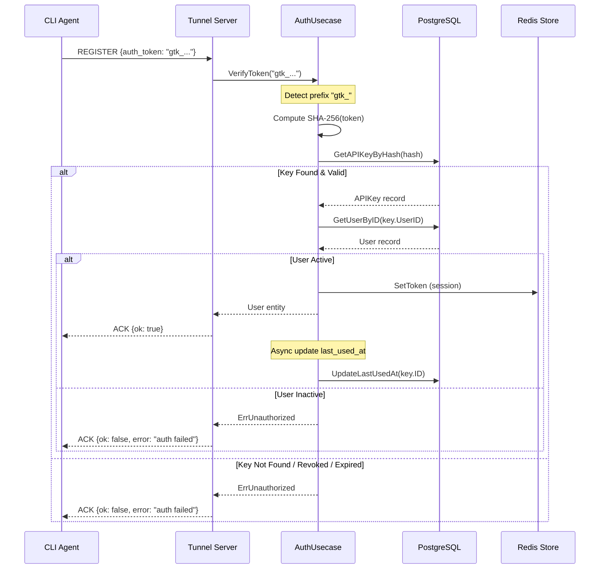
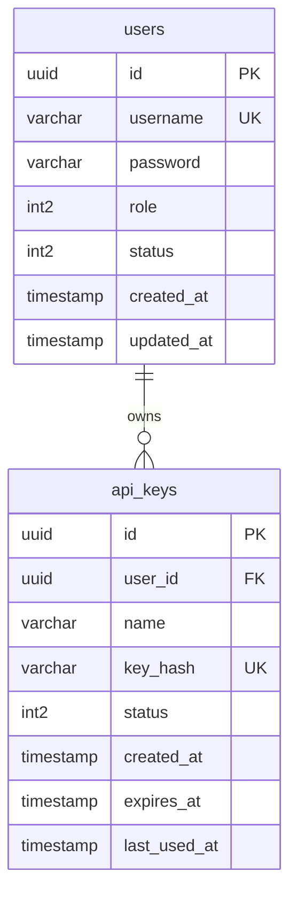

# Design Document: Direct Token Authentication

## Overview

Fitur ini menambahkan mekanisme autentikasi API Key (Direct Token) untuk CLI client go-tunnel. Saat ini, CLI agent harus melalui alur login interaktif (username + password → JWT token) sebelum membuat tunnel. Fitur ini memungkinkan user untuk membuat API key long-lived dari Web UI yang dapat digunakan langsung oleh CLI client tanpa login interaktif.

### Goals

1. Memungkinkan autentikasi tunnel tanpa interaksi user (headless/automated deployments)
2. Menyediakan API key management yang aman melalui Web UI
3. Mendukung CI/CD pipelines dan server environments
4. Menjaga kompatibilitas penuh dengan autentikasi JWT yang sudah ada

### Non-Goals

1. Mengganti sistem JWT yang sudah ada (API key adalah alternatif, bukan pengganti)
2. Implementasi OAuth2 atau protokol autentikasi eksternal
3. API key rotation otomatis (manual revocation/creation)


## Architecture

Desain ini mengikuti layered architecture yang sudah ada di go-tunnel:

```
┌─────────────────────────────────────────────────────────────────────┐
│                         Delivery Layer                               │
├─────────────────────────┬───────────────────────────────────────────┤
│   Web Handler           │   TCP Handler                              │
│   (Token Management)    │   (Tunnel Auth)                           │
│   /api/tokens/*         │   REGISTER message                        │
└───────────┬─────────────┴─────────────┬─────────────────────────────┘
            │                           │
            ▼                           ▼
┌─────────────────────────────────────────────────────────────────────┐
│                         Usecase Layer                                │
│                                                                      │
│   AuthUsecase (extended)                                            │
│   - VerifyToken() → routes to JWT or API Key path based on prefix   │
│   - CreateAPIKey()                                                  │
│   - RevokeAPIKey()                                                  │
│   - ListAPIKeys()                                                   │
└───────────┬─────────────────────────────────────────────────────────┘
            │
            ▼
┌─────────────────────────────────────────────────────────────────────┐
│                         Domain Layer                                 │
│                                                                      │
│   APIKey Entity                    APIKeyRepository Interface        │
│   - ID, UserID, Name              - Create, GetByHash, List         │
│   - KeyHash, Status               - Revoke, UpdateLastUsed          │
│   - CreatedAt, ExpiresAt          - CountActiveByUser               │
│   - LastUsedAt                                                      │
└───────────┬─────────────────────────────────────────────────────────┘
            │
            ▼
┌─────────────────────────────────────────────────────────────────────┐
│                      Infrastructure Layer                            │
│                                                                      │
│   PostgreSQL Repository            Redis TunnelStore (existing)      │
│   - api_keys table                 - Token session management        │
│   - CRUD operations                - SetToken, IsTokenRevoked        │
└─────────────────────────────────────────────────────────────────────┘
```


### Authentication Flow Diagram




## Components and Interfaces

### Domain Layer

#### APIKey Entity

File: `internal/domain/apikey/entity.go`

```go
package apikey

import (
    "time"
    "github.com/google/uuid"
)

// APIKeyStatus represents the status of an API key.
type APIKeyStatus int16

const (
    StatusActive  APIKeyStatus = 1
    StatusRevoked APIKeyStatus = 0
)

// APIKey represents a long-lived authentication token for CLI access.
type APIKey struct {
    ID         uuid.UUID     `db:"id" json:"id"`
    UserID     uuid.UUID     `db:"user_id" json:"user_id"`
    Name       string        `db:"name" json:"name"`
    KeyHash    string        `db:"key_hash" json:"-"` // SHA-256 hash, never exposed
    Status     APIKeyStatus  `db:"status" json:"status"`
    CreatedAt  time.Time     `db:"created_at" json:"created_at"`
    ExpiresAt  *time.Time    `db:"expires_at" json:"expires_at"` // nil = no expiration
    LastUsedAt *time.Time    `db:"last_used_at" json:"last_used_at"`
}

// APIKeyWithOwner includes owner username for admin listing.
type APIKeyWithOwner struct {
    APIKey
    Username string `db:"username" json:"username"`
}

// IsExpired checks if the key has passed its expiration date.
func (k *APIKey) IsExpired() bool {
    if k.ExpiresAt == nil {
        return false
    }
    return time.Now().After(*k.ExpiresAt)
}

// IsValid checks if the key is active and not expired.
func (k *APIKey) IsValid() bool {
    return k.Status == StatusActive && !k.IsExpired()
}
```


#### APIKeyRepository Interface

File: `internal/domain/apikey/repository.go`

```go
package apikey

import (
    "context"
    "github.com/google/uuid"
)

// APIKeyRepository defines the persistence contract for API keys.
//
//mockery:generate: true
type APIKeyRepository interface {
    // Create stores a new API key record.
    Create(ctx context.Context, key *APIKey) error

    // GetByHash retrieves an API key by its SHA-256 hash.
    // Returns nil, nil if not found.
    GetByHash(ctx context.Context, keyHash string) (*APIKey, error)

    // GetByID retrieves an API key by its UUID.
    GetByID(ctx context.Context, id uuid.UUID) (*APIKey, error)

    // ListByUserID returns all API keys owned by a user (excluding hash).
    // Results are sorted by created_at DESC.
    ListByUserID(ctx context.Context, userID uuid.UUID, limit, offset int) ([]APIKey, int, error)

    // ListAll returns all API keys with owner info (admin only).
    // Results are sorted by created_at DESC.
    ListAll(ctx context.Context, limit, offset int, usernameFilter string) ([]APIKeyWithOwner, int, error)

    // CountActiveByUserID returns the number of active (non-revoked, non-expired) keys for a user.
    CountActiveByUserID(ctx context.Context, userID uuid.UUID) (int, error)

    // ExistsActiveByName checks if an active key with the given name exists for a user.
    ExistsActiveByName(ctx context.Context, userID uuid.UUID, name string) (bool, error)

    // Revoke sets the key status to revoked.
    Revoke(ctx context.Context, id uuid.UUID) error

    // UpdateLastUsedAt updates the last_used_at timestamp.
    UpdateLastUsedAt(ctx context.Context, id uuid.UUID) error

    // RevokeAllByUserID revokes all keys belonging to a user.
    RevokeAllByUserID(ctx context.Context, userID uuid.UUID) error
}
```


### Usecase Layer

#### Extended AuthUsecase Interface

File: `internal/usecase/user/usecase.go` (extended)

```go
// AuthUsecase interface (extended with API key methods)
type AuthUsecase interface {
    // Existing methods...
    Login(ctx context.Context, username, password string) (token string, err error)
    LoginCLI(ctx context.Context, username, password string) (token string, err error)
    GetWebExpireDuration() time.Duration
    VerifyToken(ctx context.Context, token string) (*domainUser.User, error)
    Logout(ctx context.Context, token string) error
    CreateUser(ctx context.Context, username, password string, role int16) error
    ListUsers(ctx context.Context) ([]domainUser.User, error)
    UpdateUserStatus(ctx context.Context, id uuid.UUID, status int16) error
    UpdateUserPassword(ctx context.Context, id uuid.UUID, password string) error
    DeleteUser(ctx context.Context, id uuid.UUID) error
    RevokeUserTokens(ctx context.Context, targetUserID uuid.UUID) error

    // New API key methods
    CreateAPIKey(ctx context.Context, userID uuid.UUID, name string, expiresAt *time.Time) (plaintext string, key *domainAPIKey.APIKey, err error)
    ListAPIKeys(ctx context.Context, userID uuid.UUID, role int16, limit, offset int, usernameFilter string) ([]domainAPIKey.APIKeyWithOwner, int, error)
    RevokeAPIKey(ctx context.Context, keyID uuid.UUID, requesterID uuid.UUID, requesterRole int16) error
    GetAPIKeyByID(ctx context.Context, keyID uuid.UUID) (*domainAPIKey.APIKey, error)
}
```


#### API Key Generation Logic

```go
const (
    APIKeyPrefix    = "gtk_"
    APIKeyByteLen   = 32  // 256 bits of entropy
    MaxKeysPerUser  = 10
    MaxExpiryDays   = 365
)

func (u *authUsecase) CreateAPIKey(ctx context.Context, userID uuid.UUID, name string, expiresAt *time.Time) (string, *domainAPIKey.APIKey, error) {
    // 1. Validate name (1-64 chars, alphanumeric + hyphen + underscore)
    if err := validateKeyName(name); err != nil {
        return "", nil, err
    }

    // 2. Check for duplicate name
    exists, err := u.apiKeyRepo.ExistsActiveByName(ctx, userID, name)
    if err != nil {
        return "", nil, fmt.Errorf("check duplicate name: %w", err)
    }
    if exists {
        return "", nil, domainErrors.ErrAlreadyExists
    }

    // 3. Check max keys limit
    count, err := u.apiKeyRepo.CountActiveByUserID(ctx, userID)
    if err != nil {
        return "", nil, fmt.Errorf("count active keys: %w", err)
    }
    if count >= MaxKeysPerUser {
        return "", nil, fmt.Errorf("maximum of %d active API keys reached", MaxKeysPerUser)
    }

    // 4. Validate expiration date
    if expiresAt != nil {
        if expiresAt.Before(time.Now()) {
            return "", nil, fmt.Errorf("expiration date must be in the future")
        }
        if expiresAt.After(time.Now().AddDate(0, 0, MaxExpiryDays)) {
            return "", nil, fmt.Errorf("expiration date cannot exceed %d days", MaxExpiryDays)
        }
    }

    // 5. Generate cryptographically secure random bytes
    rawBytes := make([]byte, APIKeyByteLen)
    if _, err := crypto_rand.Read(rawBytes); err != nil {
        return "", nil, fmt.Errorf("generate random bytes: %w", err)
    }

    // 6. Create plaintext key with prefix
    plaintext := APIKeyPrefix + base64.URLEncoding.EncodeToString(rawBytes)

    // 7. Hash for storage (SHA-256)
    hash := sha256.Sum256([]byte(plaintext))
    keyHash := hex.EncodeToString(hash[:])

    // 8. Create and persist record
    key := &domainAPIKey.APIKey{
        ID:        uuid.New(),
        UserID:    userID,
        Name:      name,
        KeyHash:   keyHash,
        Status:    domainAPIKey.StatusActive,
        CreatedAt: time.Now(),
        ExpiresAt: expiresAt,
    }

    if err := u.apiKeyRepo.Create(ctx, key); err != nil {
        return "", nil, fmt.Errorf("persist API key: %w", err)
    }

    return plaintext, key, nil
}
```


#### Token Verification (Extended)

```go
func (u *authUsecase) VerifyToken(ctx context.Context, tokenStr string) (*domainUser.User, error) {
    // Route to API Key verification if prefix matches
    if strings.HasPrefix(tokenStr, APIKeyPrefix) {
        return u.verifyAPIKey(ctx, tokenStr)
    }

    // Existing JWT verification path...
    return u.verifyJWT(ctx, tokenStr)
}

func (u *authUsecase) verifyAPIKey(ctx context.Context, tokenStr string) (*domainUser.User, error) {
    // 1. Validate format: must have content after prefix
    if len(tokenStr) <= len(APIKeyPrefix) {
        return nil, domainErrors.ErrUnauthorized
    }

    // 2. Compute hash for lookup
    hash := sha256.Sum256([]byte(tokenStr))
    keyHash := hex.EncodeToString(hash[:])

    // 3. Lookup key by hash
    key, err := u.apiKeyRepo.GetByHash(ctx, keyHash)
    if err != nil {
        return nil, domainErrors.ErrUnauthorized
    }
    if key == nil {
        return nil, domainErrors.ErrUnauthorized
    }

    // 4. Check key validity (status + expiration)
    if !key.IsValid() {
        return nil, domainErrors.ErrUnauthorized
    }

    // 5. Lookup owner user
    user, err := u.userRepo.GetUserByID(ctx, key.UserID)
    if err != nil || user == nil {
        return nil, domainErrors.ErrUnauthorized
    }

    // 6. Check user is active
    if user.Status != 1 {
        return nil, domainErrors.ErrUnauthorized
    }

    // 7. Async update last_used_at (non-blocking)
    go func() {
        ctx, cancel := context.WithTimeout(context.Background(), 5*time.Second)
        defer cancel()
        _ = u.apiKeyRepo.UpdateLastUsedAt(ctx, key.ID)
    }()

    // 8. Register session in Redis for consistency with JWT flow
    expiration := 24 * time.Hour
    if key.ExpiresAt != nil {
        expiration = time.Until(*key.ExpiresAt)
    }
    _ = u.store.SetToken(ctx, user.ID.String(), tokenStr, expiration)

    return user, nil
}
```


### Infrastructure Layer

#### PostgreSQL Repository Implementation

File: `internal/infrastructure/database/postgres/apikey.go`

```go
package postgres

import (
    "context"
    "database/sql"
    "errors"
    "fmt"

    domainAPIKey "gotunnel/internal/domain/apikey"

    "github.com/google/uuid"
    "github.com/jmoiron/sqlx"
)

type sqlxAPIKeyRepository struct {
    db *sqlx.DB
}

func NewAPIKeyRepository(db *sqlx.DB) domainAPIKey.APIKeyRepository {
    return &sqlxAPIKeyRepository{db: db}
}

func (r *sqlxAPIKeyRepository) Create(ctx context.Context, key *domainAPIKey.APIKey) error {
    query := `
        INSERT INTO api_keys (id, user_id, name, key_hash, status, created_at, expires_at)
        VALUES ($1, $2, $3, $4, $5, $6, $7)
    `
    _, err := r.db.ExecContext(ctx, query,
        key.ID, key.UserID, key.Name, key.KeyHash, key.Status, key.CreatedAt, key.ExpiresAt)
    if err != nil {
        return fmt.Errorf("Create API key error: %w", err)
    }
    return nil
}

func (r *sqlxAPIKeyRepository) GetByHash(ctx context.Context, keyHash string) (*domainAPIKey.APIKey, error) {
    var key domainAPIKey.APIKey
    query := `
        SELECT id, user_id, name, key_hash, status, created_at, expires_at, last_used_at
        FROM api_keys WHERE key_hash = $1
    `
    err := r.db.GetContext(ctx, &key, query, keyHash)
    if err != nil {
        if errors.Is(err, sql.ErrNoRows) {
            return nil, nil
        }
        return nil, fmt.Errorf("GetByHash error: %w", err)
    }
    return &key, nil
}
```


### Delivery Layer

#### Web Handler for Token Management

File: `internal/delivery/web/handler/token.go`

```go
package handler

import (
    "embed"
    "encoding/json"
    "html/template"
    "net/http"
    "strconv"
    "time"

    domainErrors "gotunnel/internal/domain/errors"
    usecaseUser "gotunnel/internal/usecase/user"

    "github.com/go-chi/chi/v5"
    "github.com/google/uuid"
)

type TokenHandler struct {
    tmpl        *template.Template
    authUsecase usecaseUser.AuthUsecase
}

func NewToken(fs embed.FS, authUsecase usecaseUser.AuthUsecase) *TokenHandler {
    tmpl := template.Must(template.ParseFS(fs,
        "templates/base.html",
        "templates/tokens.html",
    ))
    return &TokenHandler{
        tmpl:        tmpl,
        authUsecase: authUsecase,
    }
}

// TokensPage renders the token management page.
func (h *TokenHandler) TokensPage(w http.ResponseWriter, r *http.Request) {
    userRole := r.Context().Value(UserRoleKey).(int16)
    username := r.Context().Value(UserNameKey).(string)

    _ = h.tmpl.ExecuteTemplate(w, "base", map[string]any{
        "Page":     "tokens",
        "Username": username,
        "Role":     userRole,
    })
}

// CreateToken creates a new API key.
func (h *TokenHandler) CreateToken(w http.ResponseWriter, r *http.Request) {
    userIDStr := r.Context().Value(UserIDKey).(string)
    userID, _ := uuid.Parse(userIDStr)

    var req struct {
        Name      string  `json:"name"`
        ExpiresAt *string `json:"expires_at,omitempty"`
    }
    if err := json.NewDecoder(r.Body).Decode(&req); err != nil {
        http.Error(w, `{"error":"invalid request body"}`, http.StatusBadRequest)
        return
    }

    var expiresAt *time.Time
    if req.ExpiresAt != nil && *req.ExpiresAt != "" {
        t, err := time.Parse(time.RFC3339, *req.ExpiresAt)
        if err != nil {
            http.Error(w, `{"error":"invalid expires_at format"}`, http.StatusBadRequest)
            return
        }
        expiresAt = &t
    }

    plaintext, key, err := h.authUsecase.CreateAPIKey(r.Context(), userID, req.Name, expiresAt)
    if err != nil {
        // Handle specific errors
        http.Error(w, fmt.Sprintf(`{"error":"%s"}`, err.Error()), http.StatusBadRequest)
        return
    }

    w.Header().Set("Content-Type", "application/json")
    w.WriteHeader(http.StatusCreated)
    _ = json.NewEncoder(w).Encode(map[string]any{
        "key":        plaintext,
        "id":         key.ID,
        "name":       key.Name,
        "expires_at": key.ExpiresAt,
        "created_at": key.CreatedAt,
    })
}
```


#### CLI Client Modifications

File: `internal/client/client.go` (modifications)

```go
// NewClient accepts token override for direct API key authentication
func NewClient(cfg *clientconfig.TunnelClientConfig, tokenOverride string) *Client {
    // ... existing initialization ...
    
    c := &Client{cfg: cfg, routes: r, modes: m, logger: logger}
    
    // Token override takes precedence
    if tokenOverride != "" {
        c.cfg.AuthToken = tokenOverride
    }
    
    return c
}
```

File: `cmd/client/main.go` (modifications)

```go
func main() {
    // Parse flags
    tokenFlag := flag.String("token", "", "API key for authentication (gtk_...)")
    // ... other flags ...
    flag.Parse()

    // Check environment variable
    tokenEnv := os.Getenv("GOTUNNEL_TOKEN")

    // Determine token: flag takes precedence over env
    var token string
    if *tokenFlag != "" {
        token = *tokenFlag
    } else if tokenEnv != "" {
        token = tokenEnv
    }

    // Validate token format if provided
    if token != "" {
        if !strings.HasPrefix(token, "gtk_") {
            fmt.Fprintln(os.Stderr, "Error: token must start with 'gtk_' prefix")
            os.Exit(1)
        }
    }

    // Load config
    cfg := loadConfig()

    // If direct token provided, use it; otherwise require stored credential
    if token != "" {
        cfg.AuthToken = token
    } else if cfg.AuthToken == "" {
        fmt.Fprintln(os.Stderr, "Error: authentication required. Use --token flag, GOTUNNEL_TOKEN env, or run 'gotunnel-client login'")
        os.Exit(1)
    }

    // Run client
    c := client.NewClient(cfg, token)
    c.RunForever()
}
```


## Data Models

### Database Schema

File: `db/migrations/000005_create_api_keys_table.up.sql`

```sql
CREATE TABLE IF NOT EXISTS api_keys (
    id UUID PRIMARY KEY DEFAULT uuidv7(),
    user_id UUID NOT NULL REFERENCES users(id) ON DELETE CASCADE,
    name VARCHAR(64) NOT NULL,
    key_hash VARCHAR(64) NOT NULL,  -- SHA-256 hex (64 chars)
    status INT2 NOT NULL DEFAULT 1, -- 1: active, 0: revoked
    created_at TIMESTAMP WITH TIME ZONE DEFAULT CURRENT_TIMESTAMP,
    expires_at TIMESTAMP WITH TIME ZONE,  -- NULL = no expiration
    last_used_at TIMESTAMP WITH TIME ZONE,
    
    -- Constraints
    CONSTRAINT api_keys_name_unique UNIQUE (user_id, name) 
        WHERE status = 1,  -- Unique only among active keys
    CONSTRAINT api_keys_key_hash_unique UNIQUE (key_hash)
);

-- Index for fast hash lookup (O(log n))
CREATE INDEX idx_api_keys_key_hash ON api_keys(key_hash);

-- Index for listing user's keys
CREATE INDEX idx_api_keys_user_id ON api_keys(user_id, created_at DESC);

-- Index for counting active keys
CREATE INDEX idx_api_keys_user_active ON api_keys(user_id, status) 
    WHERE status = 1;
```

File: `db/migrations/000005_create_api_keys_table.down.sql`

```sql
DROP TABLE IF EXISTS api_keys;
```

### Entity-Relationship Diagram




## Correctness Properties

*A property is a characteristic or behavior that should hold true across all valid executions of a system-essentially, a formal statement about what the system should do. Properties serve as the bridge between human-readable specifications and machine-verifiable correctness guarantees.*

### Property 1: API Key Format Validity

*For any* generated API key, the key SHALL start with the `gtk_` prefix and have a minimum length of 47 characters (4 char prefix + 43 char base64 encoding of 32 bytes).

**Validates: Requirements 1.2, 1.6**

### Property 2: Name Validation Rejection

*For any* string that is empty, exceeds 64 characters, or contains characters outside `[a-zA-Z0-9_-]`, the CreateAPIKey operation SHALL reject the request with a validation error.

**Validates: Requirements 1.7**

### Property 3: Expiration Date Validation

*For any* expiration date that is in the past or more than 365 days in the future, the CreateAPIKey operation SHALL reject the request with an error indicating the allowed range.

**Validates: Requirements 1.4**


### Property 4: Revoked Key Authentication Failure

*For any* API key with status "revoked", authentication attempts using that key SHALL fail with an unauthorized error, regardless of other key attributes (expiration, owner status).

**Validates: Requirements 2.4, 4.4**

### Property 5: Expired Key Authentication Failure

*For any* API key where `expires_at` is not NULL and the current time is at or past `expires_at`, authentication attempts using that key SHALL fail with an unauthorized error.

**Validates: Requirements 2.3, 4.4**

### Property 6: Key Hash Exclusion in Responses

*For any* API key listing response (both user-specific and admin views), no returned key record SHALL contain the `key_hash` field or any derivable form of the plaintext key.

**Validates: Requirements 2.5, 6.3**

### Property 7: Ownership-Based Revocation Authorization

*For any* API key and revocation request:
- If the requester owns the key, revocation SHALL succeed
- If the requester is admin (role=1), revocation SHALL succeed regardless of ownership
- If the requester is non-admin and does not own the key, revocation SHALL fail with forbidden error

**Validates: Requirements 3.1, 3.2, 3.3**


### Property 8: User State Change Cascades to API Keys

*For any* user with one or more API keys, when the user account is deleted OR deactivated (status changed from active), all API keys belonging to that user SHALL be revoked such that subsequent authentication attempts fail.

**Validates: Requirements 3.4, 3.5, 3.6**

### Property 9: Valid API Key Returns Correct User Entity

*For any* valid API key (exists, active status, not expired, owner is active), authentication SHALL succeed and return a User entity where:
- `ID` matches the key owner's ID
- `Username` matches the key owner's username
- `Role` matches the key owner's role

**Validates: Requirements 4.3, 4.6**

### Property 10: Token Routing Based on Prefix

*For any* auth_token in a REGISTER message:
- If the token starts with `gtk_` and has at least one character after the prefix, it SHALL be routed to the API key verification path
- If the token starts with `gtk_` but has no characters after the prefix, it SHALL be rejected with invalid format error
- If the token does not start with `gtk_`, it SHALL be routed to the JWT verification path

**Validates: Requirements 4.1, 4.2**

### Property 11: CLI Token Format Validation

*For any* value provided to CLI via `--token` flag or `GOTUNNEL_TOKEN` environment variable:
- If the value starts with `gtk_`, the CLI SHALL use it directly as auth_token without attempting login
- If the value does NOT start with `gtk_`, the CLI SHALL print an error and exit with code 1 without connecting
- The `--token` flag SHALL take precedence over `GOTUNNEL_TOKEN` when both are present

**Validates: Requirements 5.1, 5.2, 5.4**


## Error Handling

### Authentication Errors

| Scenario | Error Response | HTTP Status |
|----------|----------------|-------------|
| Token not found | `{"error":"unauthorized"}` | 401 |
| Token revoked | `{"error":"unauthorized"}` | 401 |
| Token expired | `{"error":"unauthorized"}` | 401 |
| Owner user inactive | `{"error":"unauthorized"}` | 401 |
| Invalid token format (empty after prefix) | `{"error":"unauthorized"}` | 401 |

**Security Note**: All authentication failures return the same generic error to prevent information leakage about which specific check failed.

### API Key Creation Errors

| Scenario | Error Response | HTTP Status |
|----------|----------------|-------------|
| Empty name | `{"error":"name is required and must be 1-64 characters"}` | 400 |
| Name too long (>64 chars) | `{"error":"name is required and must be 1-64 characters"}` | 400 |
| Invalid characters in name | `{"error":"name can only contain alphanumeric characters, hyphens, and underscores"}` | 400 |
| Duplicate active name | `{"error":"an active key with this name already exists"}` | 409 |
| Expiration in past | `{"error":"expiration date must be in the future"}` | 400 |
| Expiration > 365 days | `{"error":"expiration date cannot exceed 365 days from now"}` | 400 |
| Max keys limit (10) reached | `{"error":"maximum of 10 active API keys reached"}` | 400 |

### Revocation Errors

| Scenario | Error Response | HTTP Status |
|----------|----------------|-------------|
| Key not found | `{"error":"API key not found"}` | 404 |
| Not owner and not admin | `{"error":"forbidden"}` | 403 |
| Database unreachable | `{"error":"internal server error"}` | 500 |

### CLI Exit Codes

| Scenario | Exit Code | Stderr Message |
|----------|-----------|----------------|
| Invalid token format (no gtk_ prefix) | 1 | `Error: token must start with 'gtk_' prefix` |
| No token or stored credential | 1 | `Error: authentication required. Use --token flag, GOTUNNEL_TOKEN env, or run 'gotunnel-client login'` |
| Server rejected authentication | 1 | Server error message |


## Testing Strategy

### Dual Testing Approach

Fitur ini menggunakan kombinasi unit tests (untuk contoh spesifik dan edge cases) dan property-based tests (untuk memverifikasi universal properties).

### Unit Tests

#### Domain Layer
- `TestAPIKey_IsExpired`: verify expiration logic with specific dates
- `TestAPIKey_IsValid`: verify combined status + expiration check

#### Usecase Layer
- `TestCreateAPIKey_Success`: valid creation flow
- `TestCreateAPIKey_DuplicateName`: rejection on duplicate
- `TestCreateAPIKey_MaxKeysReached`: edge case at 10 keys
- `TestVerifyAPIKey_Success`: valid key authentication
- `TestVerifyAPIKey_NotFound`: key hash not in DB
- `TestVerifyAPIKey_Revoked`: revoked key rejection
- `TestVerifyAPIKey_Expired`: expired key rejection
- `TestVerifyAPIKey_InactiveUser`: user status check
- `TestRevokeAPIKey_OwnerSuccess`: user revoking own key
- `TestRevokeAPIKey_AdminSuccess`: admin revoking any key
- `TestRevokeAPIKey_NonOwnerForbidden`: non-owner rejection

#### Infrastructure Layer
- `TestAPIKeyRepository_Create`: DB insertion
- `TestAPIKeyRepository_GetByHash`: hash lookup with index
- `TestAPIKeyRepository_CountActiveByUserID`: active count query
- `TestAPIKeyRepository_RevokeAllByUserID`: cascade revocation

#### Delivery Layer
- `TestTokenHandler_CreateToken`: API endpoint
- `TestTokenHandler_ListTokens`: pagination
- `TestTokenHandler_RevokeToken`: revocation endpoint


### Property-Based Tests

Property-based tests akan diimplementasikan menggunakan library `github.com/leanovate/gopter` dengan minimum 100 iterasi per property.

#### Test File: `internal/usecase/user/auth_apikey_property_test.go`

```go
// Feature: direct-token-auth, Property 1: API Key Format Validity
func TestProperty_APIKeyFormat(t *testing.T) {
    properties := gopter.NewProperties(parameters)
    
    properties.Property("generated keys have valid format", prop.ForAll(
        func(name string, expiresAt *time.Time) bool {
            plaintext, _, err := usecase.CreateAPIKey(ctx, userID, name, expiresAt)
            if err != nil {
                return true // validation errors are expected for invalid inputs
            }
            return strings.HasPrefix(plaintext, "gtk_") && len(plaintext) >= 47
        },
        genValidName(),
        genValidExpiration(),
    ))
    
    properties.TestingRun(t)
}

// Feature: direct-token-auth, Property 2: Name Validation Rejection
func TestProperty_NameValidation(t *testing.T) {
    properties := gopter.NewProperties(parameters)
    
    properties.Property("invalid names are rejected", prop.ForAll(
        func(name string) bool {
            _, _, err := usecase.CreateAPIKey(ctx, userID, name, nil)
            return err != nil
        },
        genInvalidName(), // empty, >64 chars, or invalid chars
    ))
    
    properties.TestingRun(t)
}

// Feature: direct-token-auth, Property 4: Revoked Key Authentication Failure
func TestProperty_RevokedKeyAuth(t *testing.T) {
    properties := gopter.NewProperties(parameters)
    
    properties.Property("revoked keys fail authentication", prop.ForAll(
        func(key *domainAPIKey.APIKey) bool {
            key.Status = domainAPIKey.StatusRevoked
            mockRepo.On("GetByHash", mock.Anything, key.KeyHash).Return(key, nil)
            
            _, err := usecase.VerifyToken(ctx, "gtk_"+key.RawToken)
            return errors.Is(err, domainErrors.ErrUnauthorized)
        },
        genAPIKey(),
    ))
    
    properties.TestingRun(t)
}
```


### Property Test Generators

```go
// genValidName generates valid API key names (1-64 chars, alphanumeric + hyphen + underscore)
func genValidName() gopter.Gen {
    return gen.RegexMatch(`^[a-zA-Z0-9_-]{1,64}$`)
}

// genInvalidName generates invalid API key names
func genInvalidName() gopter.Gen {
    return gen.OneOf(
        gen.Const(""),                           // empty
        gen.RegexMatch(`^[a-zA-Z0-9_-]{65,100}$`), // too long
        gen.RegexMatch(`^.*[!@#$%^&*()].*$`),    // invalid chars
    )
}

// genValidExpiration generates valid expiration dates (now to 365 days)
func genValidExpiration() gopter.Gen {
    return gen.OneOf(
        gen.Const((*time.Time)(nil)), // no expiration
        gen.IntRange(1, 365).Map(func(days int) *time.Time {
            t := time.Now().AddDate(0, 0, days)
            return &t
        }),
    )
}

// genInvalidExpiration generates invalid expiration dates
func genInvalidExpiration() gopter.Gen {
    return gen.OneOf(
        gen.IntRange(-365, -1).Map(func(days int) *time.Time {
            t := time.Now().AddDate(0, 0, days) // past
            return &t
        }),
        gen.IntRange(366, 730).Map(func(days int) *time.Time {
            t := time.Now().AddDate(0, 0, days) // > 365 days
            return &t
        }),
    )
}

// genAPIKey generates random API key entities for testing
func genAPIKey() gopter.Gen {
    return gopter.CombineGens(
        gen.UUID(),
        gen.UUID(),
        genValidName(),
        gen.OneOf(
            gen.Const(domainAPIKey.StatusActive),
            gen.Const(domainAPIKey.StatusRevoked),
        ),
        genValidExpiration(),
    ).Map(func(vals []interface{}) *domainAPIKey.APIKey {
        return &domainAPIKey.APIKey{
            ID:        vals[0].(uuid.UUID),
            UserID:    vals[1].(uuid.UUID),
            Name:      vals[2].(string),
            Status:    vals[3].(domainAPIKey.APIKeyStatus),
            ExpiresAt: vals[4].(*time.Time),
            CreatedAt: time.Now(),
        }
    })
}
```

### Integration Tests

- Database migration test: verify schema creates correctly
- End-to-end auth flow: create key → use key → revoke key
- Tunnel server integration: verify API key works for REGISTER
- CLI integration: verify --token and GOTUNNEL_TOKEN handling


## Implementation Notes

### Required Additions to Existing Interfaces

#### UserRepository Extension

File: `internal/domain/user/repository.go`

Method `GetUserByID` perlu ditambahkan untuk mendukung API key verification yang mengambil user berdasarkan `user_id` dari API key record:

```go
type UserRepository interface {
    // Existing methods...
    GetUserByUsername(ctx context.Context, username string) (*User, error)
    CreateUser(ctx context.Context, user *User) error
    // ... other existing methods ...

    // NEW: Required for API key authentication
    GetUserByID(ctx context.Context, id uuid.UUID) (*User, error)
}
```

Implementation di `internal/infrastructure/database/postgres/user.go`:

```go
func (r *sqlxUserRepository) GetUserByID(ctx context.Context, id uuid.UUID) (*domainUser.User, error) {
    var user domainUser.User
    query := `SELECT id, username, password, role, status, created_at, updated_at 
              FROM users WHERE id = $1`
    err := r.db.GetContext(ctx, &user, query, id)
    if err != nil {
        if errors.Is(err, sql.ErrNoRows) {
            return nil, nil
        }
        return nil, fmt.Errorf("GetUserByID error: %w", err)
    }
    return &user, nil
}
```

### DI Wiring Changes

File: `internal/di/webui.go` dan `internal/di/tunnel.go`

Tambahkan `APIKeyRepository` ke dependency injection:

```go
func BuildWebUIApp(cfg *config.ServerConfig) (*WebUIApp, func()) {
    // ... existing initialization ...
    
    // Add API Key repository
    apiKeyRepo := postgres.NewAPIKeyRepository(db)
    
    // Update AuthUsecase initialization
    authUsecase := user.NewAuthUsecase(
        userRepo, 
        tunnelStore, 
        cfg.JWTSecret, 
        cfg.WebJWTExpireHours, 
        cfg.CLIJWTExpireHours,
        apiKeyRepo,  // NEW parameter
    )
    
    // ... rest of initialization ...
}
```

### Web UI Route Registration

File: `internal/delivery/web/handler/router.go` (atau equivalen)

```go
// Token management routes (JWT + CSRF required)
r.Route("/tokens", func(r chi.Router) {
    r.Get("/", tokenHandler.TokensPage)
})

r.Route("/api/tokens", func(r chi.Router) {
    r.Get("/", tokenHandler.ListTokens)
    r.Post("/", tokenHandler.CreateToken)
    r.Delete("/{id}", tokenHandler.RevokeToken)
})
```

### HTML Template

File: `assets/templates/tokens.html`

Template untuk halaman manajemen API keys akan menyertakan:
- Tabel daftar API keys dengan pagination
- Form untuk membuat key baru (name, expiration)
- Modal untuk menampilkan plaintext key sekali saat creation
- Button untuk revoke key dengan konfirmasi

