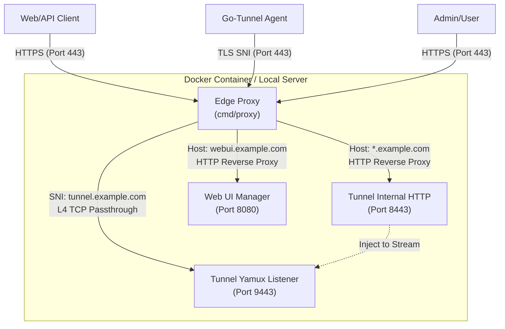

# go-tunnel

Go-based reverse tunneling gateway that exposes private services over public TLS/HTTPS. The server keeps Let's Encrypt certificates up to date, while the agent (client) opens an outbound TLS connection and forwards HTTP or raw TCP traffic over a Yamux multiplexer.

## Key Features
- **Automatic TLS termination** via ACME/Let's Encrypt using `autocert.Manager`.
- **Multiplexing**: Many logical streams over a single TLS connection with `hashicorp/yamux`.
- **PostgreSQL Config Management**: Client configs are stored in PostgreSQL per user. Create, list, and manage configurations directly from the WebUI.
- **Interactive CLI & Seamless Downloads**: The client CLI supports interactive login (`gotunnel login`), configuration listing (`gotunnel list`), and execution (`gotunnel run <name>`).
- **One-liner Installations**: The Web UI serves pre-compiled binaries for MacOS, Linux, and Windows with dynamic `curl` install scripts.
- **Redis-backed Auth**: Web UI sessions and Client tokens are stored in Redis with **instant revocation** support.
- **Domain Management**: Centrally manage authorized subdomains under a base wildcard domain (e.g., `*.apps.com`) via Web UI.
- **Wildcard Subdomain Support**: Flexible routing using manual or auto-generated random subdomains stored in Redis.
- **Supports HTTP, HTTPS & TCP**: Tunneling for web applications and raw TCP protocols (SSH, DB, etc.).

## Tech Stack
- **Language**: Go 1.25
- **Multiplexing**: `github.com/hashicorp/yamux`
- **Database (Config)**: PostgreSQL (`github.com/jackc/pgx/v5`)
- **State & Session**: Redis (`github.com/redis/go-redis/v9`)
- **Web UI**: Alpine.js, Tailwind CSS (via CDN), Go Templates.
- **Auth**: JWT (`github.com/golang-jwt/jwt/v5`) & HMAC-SHA256 for client tokens.
- **Logging**: `go.uber.org/zap`

## Web UI Manager
This application includes a Web UI Manager running on port `8080` (default) for easy management:
- **Login**: Secure authentication with sessions stored in Redis. (Default: `admin` / `admin123`).
- **Dashboard**: View the list of currently connected tunnels, including **Client ID**, source IP, assigned hosts, and connection time.
- **Domain Manager**: Register manual subdomains or **auto-generate random strings** under your base wildcard domain.
- **Config Editor**: Manage client configurations per user, saved securely to PostgreSQL.
- **Client Downloads**: Download pre-compiled, auto-configured agent binaries for MacOS, Linux, and Windows straight from the dashboard.
- **Token Management**: Generate new tokens for clients or instantly **revoke** existing tokens to disconnect specific agents.

## Example DNS Records
| Type | Hostname | Value | Notes |
| --- | --- | --- | --- |
| `A` | `gateway.example.com` | `203.0.113.10` | Public HTTPS gateway + dashboard host (use your server's public IP). |
| `A` | `tunnel.example.com` | `203.0.113.10` | Agents connect here (`tunnel_addr`, also your server public IP). |
| `CNAME` | `app.example.com` | `gateway.example.com.` | Routed via gateway to your local target. |
| `CNAME` | `*.wildcard.example.com` | `gateway.example.com.` | All subdomains routed to matching tunnel sessions. |
| `CNAME` | `ssh.example.com` | `gateway.example.com.` | TCP tunnel routed via gateway. |

## Server Configuration (`.env`)
Copy `.env.example` and adjust the variables:

| Variable | Description |
| --- | --- |
| `GATEWAY_DOMAIN` | Domain for the public HTTPS gateway. |
| `PROXY_HTTP_PORT` | Port for the public Proxy HTTP/ACME (default `80`). |
| `PROXY_HTTPS_PORT` | Port for the public Edge Gateway Proxy (default `443`). |
| `WEBUI_PORT` | Port for the Web UI Manager (default `8080`). |
| `WEBUI_DOMAIN` | Domain for accessing the Web UI (e.g., `webui.example.com`). |
| `GATEWAY_PORT` | Internal port used by the Tunnel to handle local HTTP traffic (default `8443`). |
| `TUNNEL_DOMAIN` | Domain for agent TCP connections (SNI, e.g. `tunnel.example.com`). |
| `TUNNEL_PORT` | Port for agent TCP Yamux connections (default `9443`). |
| `JWT_SECRET` | Master secret used to generate client tokens and JWTs. |
| `ACME_CACHE` | Directory to store Let's Encrypt certificates (default `./cert-cache`). |
| `ACME_ENV` | Let's Encrypt environment: `production` or `staging`. |
| `REDIS_ADDR` | Redis server address (default `localhost:6379`). |
| `REDIS_PASS` | Redis password (optional). |
| `REDIS_DB` | Redis database for sessions/auth (default `0`). |
| `DOMAIN_REDIS_DB` | Redis database for allowed subdomains (default `1`). |
| `WILDCARD_DOMAIN` | The base wildcard pattern (e.g., `*.yourdomain.com`). |

## How to Run

### 1. Server, Proxy & Web UI (Local)
Ensure Redis is running before starting the services.
```sh
go run ./cmd/proxy/main.go
go run ./cmd/tunnel/main.go
go run ./cmd/webui/main.go
```

### 2. Run with Docker
Build and run everything using Docker:
```sh
docker build -t gotunnel .
docker run -p 80:80 -p 443:443 --env-file .env gotunnel
```

### 3. Client/Agent
Download and install the pre-compiled client from the Web UI `Downloads` page. You can easily install it on Linux/macOS via the terminal:
```sh
curl -fsSL https://<YOUR_WEBUI_DOMAIN>/dl/install.sh | bash
```

Once installed, use the interactive CLI:
```sh
# 1. Login to retrieve your authentication token (prompts for username/password)
gotunnel login

# 2. List all available configurations attached to your account
gotunnel list

# 3. Run a specific configuration by name
gotunnel run my-web-app
```

## Token Revocation Flow
1. Admin generates a token for a specific Client ID in the Web UI.
2. The token is stored in Redis.
3. When a Client connects, the Server verifies the token status in Redis.
4. If the Admin clicks **Revoke** in the Web UI, the token is removed from Redis, and subsequent authentication attempts (or heartbeats) from that agent will be rejected.

## Domain Management Flow
1. Admin configures `WILDCARD_DOMAIN=*.example.com` in `.env`.
2. Admin uses **Domain Manager** in Web UI to add a subdomain:
   - **Manual**: Enter `myapp` -> `myapp.example.com` is added to Redis DB 1.
   - **Random**: System generates `a1b2c3d4` -> `a1b2c3d4.example.com` is added to Redis DB 1.
3. When a Client tries to register a host, the Server checks:
   - Is the host explicitly in the Redis DB 1 allowlist? (Required even if it matches the wildcard pattern).
4. If authorized, the tunnel is established and ACME SSL issuance is permitted.

## Architecture Overview
## Architecture Overview
| Component | Role |
| --- | --- |
| **Edge Proxy (`cmd/proxy`)** | Handles public HTTPS traffic, ACME Let's Encrypt, and L4 SNI Multiplexing. |
| **Tunnel Server (`cmd/tunnel`)** | Manages TCP Yamux streams and internal HTTP Demultiplexing. |
| **Web UI (`cmd/webui`)** | Provides the API and visual interface for configuration management. |
| **Redis Store** | Maintains active tunnel states and domain validation rules. |
| **Agent / Client** | The local client that opens the outbound tunnel to the server. |

## Production Architecture

`go-tunnel` is designed to be highly self-sufficient. Because we built a custom **Edge Proxy (`cmd/proxy`)** with L4 SNI Multiplexing and automatic Let's Encrypt (ACME), you **DO NOT need external reverse proxies like Nginx or HAProxy**.

Our Edge Proxy binds directly to your public port `443` and handles all complex routing internally.



### Key Considerations
1. **Single Port Exposure**: The external firewall only needs to open ports `80` (for ACME) and `443`.
2. **Microservices Routing**: Inside your server, `cmd/proxy` intelligently routes traffic:
   - Requests to `webui.example.com` are forwarded to the Web UI container (`:8080`).
   - Requests to `*.example.com` (application subdomains) are validated via Redis and forwarded to the Tunnel Internal HTTP (`:8443`).
   - Requests to `tunnel.example.com` **MUST** be forwarded using **L4 TCP Stream Passthrough** directly to the Yamux Listener (`:9443`).

Happy tunneling!
