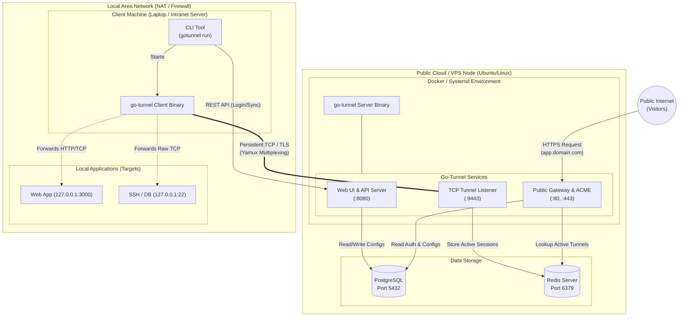

# Go-Tunnel Deployment Diagram

This document contains the Deployment Diagram for the standard (Single-Node) deployment of the **go-tunnel** system. It describes how the software components (binaries, databases, services) are mapped to the hardware (VPS server and local machines).

## Standard Deployment Architecture

## Execution Component Details

### 1. Cloud / VPS Node (Public Facing)
This server has a static Public IP and is exposed to the internet. It runs 3 main components:
- **go-tunnel Server**: The main server binary which has 3 responsibilities (running via `cmd/webui` or `cmd/server`):
  - **Web UI & API (Port 8080)**: Management portal for users to configure domains and tunnels, and serves as the API Endpoint for the Client CLI.
  - **TCP Tunnel Listener (Port 9443)**: Accepts incoming connections from client applications and establishes a secure tunnel (Yamux over TLS).
  - **Public Gateway & ACME (Port 80 & 443)**: Processes incoming traffic from internet visitors, automatically provisions SSL certificates via Let's Encrypt (ACME), and proxies HTTP/TCP routes to the appropriate client.
- **PostgreSQL**: Serves as secure, persistent storage for user accounts, hashed passwords, domain records, and tunnel configurations (target ports, hostnames).
- **Redis Server**: Stores ephemeral state quickly in-memory, such as tracking exactly which tunnel node a specific domain is currently operating on so the Gateway can route requests in microseconds.

### 2. Local Network Node (Behind NAT)
A client server or machine that lacks a Public IP, hidden behind a home router or corporate firewall.
- **go-tunnel Client**: A lightweight application that makes outbound calls to the VPS (Port 9443). Since the direction is outbound, this connection will not be blocked by NAT/Firewalls.
- **CLI Tool**: The interface used to authenticate (`gotunnel login`) and synchronize port forwarding rules from the server.
- **Local Applications**: Various pure applications (Node.js Web, MySQL database, SSH server) that are entirely unaware they are being published to the internet.

## End-to-End Traffic Flow
1. **Initiation**: `gotunnel client` initiates a TCP Dial to the `Public VPS (9443)`. A persistent pipe (Yamux Multiplex) is established.
2. **Access**: A public visitor types `https://app.domain.com` into their browser.
3. **Routing**: The `Gateway (443)` on the VPS receives the HTTPS request, reads the Host header, and looks up in Redis to find that `app.domain.com` is owned by Client A's connection.
4. **Forwarding**: The HTTPS traffic is decrypted and injected directly into Client A's pipe.
5. **Execution**: The client receives the packet on the local network and forwards it (acting as a proxy) directly to `127.0.0.1:3000`.
