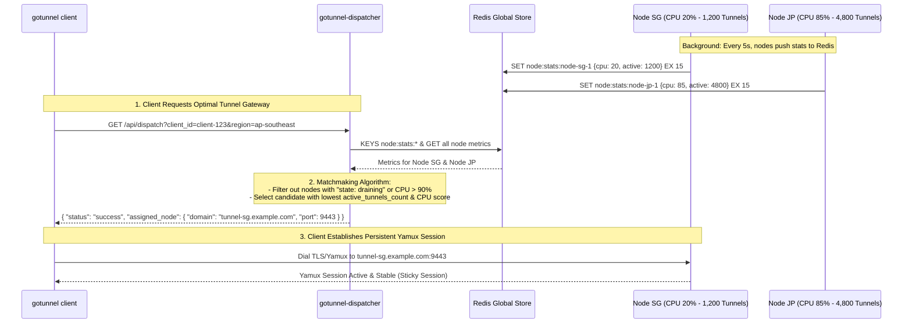

# Architectural Blueprint: Control Plane Matchmaking & Least-Load Dispatcher

This architectural blueprint outlines the design for **`gotunnel-dispatcher`**, an optional microservice (`Optional Scale-Out Brain`) responsible for dynamic matchmaking and least-load dispatching across tunnel gateways before any physical Yamux session is initiated.

---

## 1. Philosophy & Deployment Clarity

The core design philosophy of `go-tunnel` is: **"Simple on Single-Node, Clear on Multi-Node"**. Therefore, the Dispatcher service is **entirely optional** and should only be activated when your infrastructure requires high-throughput horizontal scale-out.

```
+-----------------------------------------------------------------------------------+
|                        MODE A: SINGLE NODE (DEFAULT - 90%)                        |
|                                                                                   |
|   [gotunnel client] ------------ Direct Yamux Dial -----------> [gotunnel-tunnel] |
|                                                                  (tunnel.domain)  |
|   * Dispatcher is NOT running. Resource overhead = 0%.                            |
+-----------------------------------------------------------------------------------+

+-----------------------------------------------------------------------------------+
|                  MODE B: ENTERPRISE HORIZONTAL SCALING (10%)                      |
|                                                                                   |
|   1. Query Best Node (HTTP/REST)                                                  |
|   [gotunnel client] ------------------------------> [gotunnel-dispatcher]         |
|         |                                                   |                     |
|         | 2. Assigned: "tunnel-sg.example.com"             v                     |
|         |                                           (Checks Redis Node Metrics)   |
|         v                                                                         |
|   3. Dial Yamux Session (Persistent)                                              |
|   [gotunnel client] ------------------------------> [gotunnel-tunnel (Node SG)]   |
+-----------------------------------------------------------------------------------+
```

### Comparison of Deployment Modes:
| Criteria | Mode A: Single Node (Default) | Mode B: Enterprise Cluster |
| :--- | :--- | :--- |
| **Target Users** | Personal servers, small office gateways, development, gaming. | Public SaaS platforms, multi-region clouds, >10,000 active agents. |
| **Running Services** | `webui` + `tunnel` + `proxy` | `webui` + **`dispatcher`** (Control) + *N* `tunnel` + *N* `proxy` (Regional Nodes) |
| **Dispatcher Role** | **Inactive / Not Required**. | **Active Matchmaker & L4 Load Balancer**. |
| **Client Flow (`gotunnel run`)**| Directly dials `TUNNEL_DOMAIN` specified in configuration. | Requests node recommendation from `DISPATCHER_URL` prior to dialing. |

---

## 2. Telemetry & Healthcheck API Specification (`gotunnel-server`)

To provide the Dispatcher with real-time load awareness, every `gotunnel-server` instance deployed across regional nodes must expose the following observability contract:

### A. HTTP Health & Load Endpoint
- **Method & Path**: `GET /api/health/load` (on `GatewayPort` or dedicated telemetry port).
- **JSON Response**:
  ```json
  {
    "status": "healthy",
    "node_id": "node-singapore-1",
    "region": "ap-southeast-1",
    "tunnel_domain": "tunnel-sg.example.com",
    "tunnel_port": 9443,
    "metrics": {
      "cpu_percent": 24.5,
      "ram_percent": 41.2,
      "active_tunnels_count": 1420,
      "bandwidth_tx_kbps": 45120.0,
      "bandwidth_rx_kbps": 38400.0
    },
    "state": "active",
    "timestamp": "2026-07-11T17:10:00Z"
  }
  ```

### B. Background Redis Telemetry Reporter (Optional / Recommended)
Each `gotunnel-server` periodically (every 5 seconds) reports its live metrics to the global Redis store using atomic operations so the Dispatcher does not need to poll regional nodes over HTTP:
```redis
# Key: node:stats:<node_id>
# TTL: 15 seconds (If a node crashes, its key automatically expires in Redis)
SET node:stats:node-singapore-1 '{"node_id":"node-singapore-1","cpu_percent":24.5,"active_tunnels_count":1420,"domain":"tunnel-sg.example.com","state":"active"}' EX 15
```

---

## 3. Matchmaking & Dispatch Algorithm

When `gotunnel-dispatcher` receives a node request from `gotunnel client`, it executes the following matchmaking evaluation:



### Scoring Rules:
1. **Health Filter**: Disregard any node where `state != "active"` (e.g., node marked `"draining"` for maintenance) or whose Redis heartbeat has expired (`> 15 seconds`).
2. **Hard Ceiling Filter**: Disregard any node where `cpu_percent >= 90.0%` or `active_tunnels_count >= MAX_CAPACITY`.
3. **Region Affinity (If requested)**: Prioritize nodes whose `region` tag matches the geographical hint requested by the client (e.g., `ap-southeast-1`).
4. **Least-Load Scoring**: Calculate a composite load score: $Score = (0.6 \times \frac{ActiveTunnels}{MaxCapacity}) + (0.4 \times \frac{CPUPercent}{100})$. The candidate with the lowest composite score is returned as the *Assigned Node*.

---

## 4. Dispatcher API Contract (`gotunnel-dispatcher`)

### A. Matchmaking Dispatch Endpoint
- **Method & Path**: `GET /api/dispatch`
- **Query Parameters**:
  - `client_id` (string, required): Unique identifier of the connecting client agent.
  - `client_version` (string, optional): Binary version of `gotunnel client` (for protocol compatibility check).
  - `region_hint` (string, optional): Geographical preference (e.g., `asia`, `us`, `eu`).
- **JSON Response (200 OK)**:
  ```json
  {
    "status": "success",
    "assigned_node": {
      "node_id": "node-singapore-1",
      "tunnel_domain": "tunnel-sg.example.com",
      "tunnel_port": 9443,
      "region": "ap-southeast-1"
    },
    "lease_token": "eyJhbGciOiJIUzI1NiIsIn...",
    "lease_expires_in_seconds": 60
  }
  ```
- **JSON Response When All Nodes Are at Capacity (503 Service Unavailable)**:
  ```json
  {
    "status": "error",
    "error": "all available tunnel gateways are currently at maximum capacity",
    "retry_after_seconds": 30
  }
  ```

---

## 5. Future Implementation Roadmap

When implementing this blueprint inside the `go-tunnel` repository, the following modular steps will be executed:

1. **New Microservice Binary (`cmd/dispatcher/main.go`)**:
   - Build `gotunnel-dispatcher` around a Chi HTTP router that queries live metrics from `TunnelRedisStore`.
2. **Update `Dockerfile`**:
   - Add compilation target `RUN go build -o gotunnel-dispatcher ./cmd/dispatcher/main.go` inside the `builder` stage.
   - Include conditional routing `elif [ "$ROLE" = "dispatcher" ]` in `start.sh` or create a separate container entrypoint.
3. **Update `gotunnel client` CLI (`internal/client/`)**:
   - Introduce CLI flag: `gotunnel run <id> --dispatcher https://dispatch.example.com` (or parse `GOTUNNEL_DISPATCHER_URL` environment variable).
   - If configured, the client performs an HTTP GET request to the dispatcher before initializing Yamux dialing inside `client.go`.
4. **Graceful Draining Support in Web UI**:
   - Add a *"Drain Node"* action in the System Settings page so administrators can stop accepting new tunnels on specific nodes while preserving active Yamux sessions.
