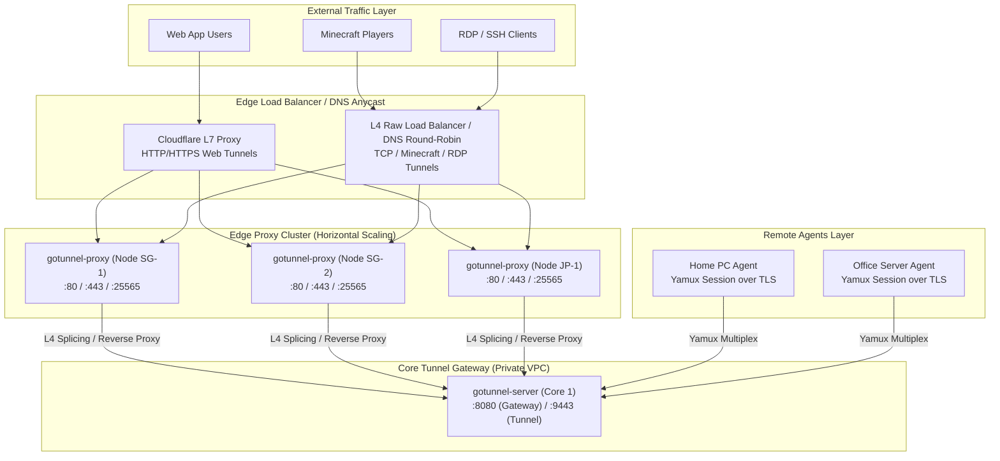
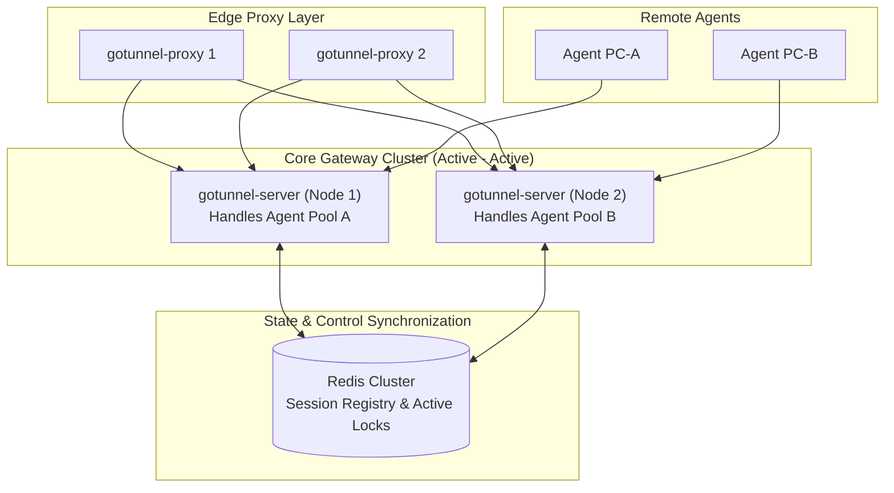

# Go-Tunnel Horizontal Scaling Strategy & Capacity Analysis

This document defines data traffic growth scenarios, physical bottleneck evaluations, and horizontal scaling strategies for the `go-tunnel` architecture.

---

## 1. Background & Core Architecture

By default, `go-tunnel` cleanly separates the **Proxy Layer (L4/L7 Traffic Gatekeeper)** from the **Server Layer (Control Plane & Yamux Tunnel Gateway)**:

```
+-----------------------------------------------------------------------------------+
|                               SINGLE NODE DEPLOYMENT                              |
|                                                                                   |
|   +--------------------+          Local TCP           +-----------------------+   |
|   |   gotunnel-proxy   | ---------------------------> |    gotunnel-server    |   |
|   |  (L4 SNI + L7 HTTP)|   (127.0.0.1:8080/9443)      |  (Yamux Session Core) |   |
|   +--------------------+                              +-----------------------+   |
|             ^                                                     ^               |
+-------------|-----------------------------------------------------|---------------+
              | Public Traffic (:80 / :443)                         | Tunnel Agent (:9443)
      [ Public Users / RDP / MC ]                              [ Remote PC / Agents ]
```

At medium scale (1,000 – 10,000 concurrent connections), running both `gotunnel-proxy` and `gotunnel-server` on a single physical node is **blazingly fast and lag-free**, safeguarded by several key architectural optimizations:
1. **L4 SNI & Minecraft Passthrough (`peekSNI` / `peekMinecraft`)**: RDP, SSH, raw TCP, and Minecraft traffic bypass L7 HTTP/TLS decryption entirely using zero-copy raw L4 splicing via `proxyConn`, achieving **0 ms processing latency**.
2. **Buffer Pools (`sync.Pool 128KB`) & `TCP_NODELAY`**: Eliminates garbage collection (GC) latency spikes and disables the Nagle algorithm on all TCP sockets to ensure instantaneous packet delivery.
3. **Yamux `MaxStreamWindowSize = 2MB`**: Prevents flow-control starvation during high-bandwidth file transfers or 60 FPS RDP streams.

However, at massive enterprise scale (tens or hundreds of thousands of concurrent sessions), a single physical server will inevitably encounter **hardware saturation boundaries**.

---

## 2. Physical Bottleneck & OS Breaking Points

| Component / Constraint | Saturation Breaking Point | Symptom | Architectural Solution |
| :--- | :--- | :--- | :--- |
| **Network Interface Card (NIC)** | Bandwidth > 1 Gbps (or > 10 Gbps on cloud NICs) | Packet loss at data center/ISP boundary, high latency spikes. | **Multi-Proxy Edge Nodes** (Horizontal L4 Scaling). |
| **OS File Descriptors (`ulimit -n`)** | > 1,024 connections (default OS) or > 65,535 sockets | Server rejects incoming connections (`socket: too many open files`). | Kernel `sysctl` tuning & `ulimit -n 1000000` + Proxy sharding. |
| **CPU TLS Decryption (L7 HTTP/HTTPS)** | > 10,000 – 25,000 HTTP Requests/sec (RPS) | 100% CPU utilization due to cryptographic TLS handshakes and encryption. | Offload TLS to Cloudflare or multi-replica Edge Proxies. |
| **Memory Buffer Allocation** | > 50,000 active streams | High memory consumption for stream buffers (~2 KB – 4 KB/stream). | Horizontal Core Gateway Sharding via Redis. |

---

## 3. Scaling Scenarios & Strategies

### Scenario A: Medium-High Scale (Single Node High-Throughput)
- **Target Capacity**: 5,000 – 15,000 concurrent connections (~1 Gbps total traffic).
- **Recommended Setup**: Maintain **1 physical machine (e.g., VPS with 4 vCPU, 8 GB RAM)**, applying OS kernel-level tuning.

#### Linux Kernel Tuning (`/etc/sysctl.conf`):
```ini
# Increase system-wide open file limits and local port range
fs.file-max = 1000000
net.ipv4.ip_local_port_range = 1024 65535

# Optimize TCP socket backlog, buffer memory, and Fast Open for low-latency gaming/RDP
net.core.somaxconn = 65535
net.ipv4.tcp_max_syn_backlog = 65535
net.ipv4.tcp_rmem = 4096 87380 16777216
net.ipv4.tcp_wmem = 4096 65536 16777216
net.ipv4.tcp_fastopen = 3
net.ipv4.tcp_tw_reuse = 1
```

---

### Scenario B: Multi-Proxy / Edge Horizontal Scaling (Massive Traffic & Anti-DDoS)
- **Target Capacity**: 20,000 – 100,000+ concurrent connections (>10 Gbps total traffic).
- **Condition**: Single server experiences NIC bandwidth saturation or frequent L7 volumetric attacks.
- **Strategy**: Shard `gotunnel-proxy` binaries across **multiple geographically distributed Edge Nodes** behind Cloudflare or an Anycast/L4 load balancer, keeping `gotunnel-server` inside a protected **Core VPC / Private Network**.



#### Mechanism of Scenario B:
1. **Edge Offloading**:
   Each Edge Node (`P1, P2, P3`) absorbs TLS handshakes and SNI/Minecraft routing checks. Socket I/O pressure is cleanly distributed across $N$ physical servers.
2. **Internal Relay to Core (`GS1`)**:
   When an Edge Node (`P1`) receives an HTTP or SNI request for `app.example.com` or `mc.example.com`, `P1` proxies the traffic directly to the Core Gateway (`GS1`) over high-speed private VPC network paths (`10.0.0.10:8080`).
3. **Environment Configuration on Edge Proxy Nodes (`.env`)**:
   ```ini
   # Configuration on Edge Proxy servers (gotunnel-proxy)
   GATEWAY_PORT=8080
   TUNNEL_PORT=9443
   # Target internal Core Gateway IP rather than local loopback 127.0.0.1
   GATEWAY_HOST=10.0.0.10
   TUNNEL_HOST=10.0.0.10
   ```

---

### Scenario C: High-Availability (HA) Core Cluster + Redis Distributed State
- **Target Capacity**: >100,000 concurrent connections & multi-server full redundancy (99.99% SLA).
- **Condition**: A single `gotunnel-server` instance can no longer manage tens of thousands of active Yamux sockets, or your architecture requires zero-downtime gateway failover.
- **Strategy**: Run multiple `gotunnel-server` instances synchronized via a **shared Redis Cluster with Active Domain Locks**.



#### Redis Synchronization Mechanism in Scenario C:
Inside the codebase (`internal/usecase/tunnel/tunnel_usecase.go`), domain registrations are validated via **Redis Active Domain Locks (`SetActiveDomain`)**:
1. When `Agent PC-A` connects to `GS1` and requests `rdp.example.com`, `GS1` acquires and writes the key `tunnel:active:rdp.example.com` in Redis.
2. If visitor traffic enters through `P2` and routes to `GS2`, `GS2` verifies the domain registry via Redis to check where `rdp.example.com` is hosted, or an L4 routing layer directs traffic based on sticky domain hashing.

---

### 3.4 Concrete Deployment Implementation Examples

To make deploying this *Separation of Concerns* (Edge Proxy vs Core Gateway vs Web UI) seamless, this repository provides production-ready manifests for both **Docker Compose** and **Kubernetes Pods**:

#### A. Horizontal Scaling with Docker Compose
Use [`deploy/docker-compose.scaling.yml`](file:///Users/kal/Projects/go-tunnel/deploy/docker-compose.scaling.yml) to launch a separated cluster on a single host or Docker Swarm engine:

```bash
# 1. Start the core cluster (1 Redis + 1 Core + 1 WebUI + 1 Proxy)
docker compose -f deploy/docker-compose.scaling.yml up -d

# 2. Horizontally scale out the stateless Edge Proxy layer to 3 replicas
docker compose -f deploy/docker-compose.scaling.yml up --scale proxy=3 -d
```

**Key Architecture Highlights:**
- The `proxy` container (`gotunnel-proxy`) is configured as a stateless gatekeeper with `TUNNEL_TARGET=http://core:8443` and `WEBUI_TARGET=http://webui:8080`.
- Because `proxy` is horizontally scaled (`proxy-1`, `proxy-2`, `proxy-3`), place an external load balancer (such as Nginx, Caddy, or HAProxy) in front of ports `80/443` to distribute incoming web traffic across replicas.

#### B. Horizontal Scaling with Kubernetes Pods
Use our comprehensive guide at [`docs/KUBERNETES_DEPLOYMENT.md`](file:///Users/kal/Projects/go-tunnel/docs/KUBERNETES_DEPLOYMENT.md) along with ready-to-deploy manifests in [`deploy/kubernetes/`](file:///Users/kal/Projects/go-tunnel/deploy/kubernetes) (`K8s / EKS / GKE / AKS`):

```bash
# Apply the complete Kubernetes suite sequentially
kubectl apply -f deploy/kubernetes/01-configmap.yaml
kubectl apply -f deploy/kubernetes/02-redis.yaml
kubectl apply -f deploy/kubernetes/03-core-gateway.yaml   # StatefulSet for Core Gateway (Ports 8443 & 9443)
kubectl apply -f deploy/kubernetes/04-webui.yaml          # Deployment for Web UI Dashboard (Port 8080)
kubectl apply -f deploy/kubernetes/05-edge-proxy.yaml     # Deployment (replicas: 3) & LoadBalancer Service
```

**Architectural Benefits of Kubernetes Topology (`deploy/kubernetes/`):**
- **Full Pod Networking Support (`Dockerfile EXPOSE`)**: The `Dockerfile` explicitly exposes internal ports `8080` (`WebUIPort`), `8443` (`GatewayPort`), and `9443` (`TunnelPort`), enabling seamless inter-pod communication over Kubernetes `ClusterIP Services`.
- **Core Gateway as `StatefulSet`**: The `gotunnel-tunnel` binary ([03-core-gateway.yaml](file:///Users/kal/Projects/go-tunnel/deploy/kubernetes/03-core-gateway.yaml)) runs as a `StatefulSet` because it maintains long-lived physical Yamux socket connections (`net.Conn`). A `StatefulSet` guarantees ordered lifecycle events, ensuring remote agents remain stable during rolling updates.
- **Autoscaling Edge Proxies (`replicas: 3+`)**: The `gotunnel-proxy` binary ([05-edge-proxy.yaml](file:///Users/kal/Projects/go-tunnel/deploy/kubernetes/05-edge-proxy.yaml)) runs as a 100% stateless `Deployment`, allowing a *Horizontal Pod Autoscaler (HPA)* to dynamically scale replicas up or down under traffic fluctuations without triggering `502 Bad Gateway` errors.

---

## 4. Comparison Matrix & Recommendations

| Parameter | Scenario A (Single Node) | Scenario B (Multi-Proxy Edge) | Scenario C (HA Cluster + Redis) |
| :--- | :--- | :--- | :--- |
| **Physical Nodes / VPS** | 1 Server | 2 – 5 Servers (1 Core, *N* Edge) | > 5 Servers (Core & Edge Sharded) |
| **Total Throughput Target** | ~1 Gbps | 10 – 40 Gbps | > 40 Gbps |
| **Max Concurrent Tunnels** | ~10,000 | ~50,000 | > 100,000 |
| **Infrastructure Complexity** | ⭐ Low (Easy maintenance) | ⭐⭐⭐ Moderate (DNS/VPC mapping) | ⭐⭐⭐⭐⭐ High (Redis & Mesh VPC) |
| **Recommended Use Case** | **90% of Standard Deployments** (Personal, office, dev, gaming). | **Public SaaS Platforms** or deployments facing volumetric DDoS. | **Large Enterprise / Cloud Providers**. |

---

## 5. Executive Summary & Conclusion

1. **High Baseline Performance**:
   Do not prematurely scale horizontally if your traffic remains under 1 Gbps or `< 10,000` concurrent connections. The L4 SNI/Minecraft fast-path architecture and `netutil.CopyBuffer` zero-copy optimizations built into `go-tunnel` already guarantee **0 ms extra CPU latency**.
2. **Seamless Scale-Out When Needed**:
   The two core components (`gotunnel-proxy` and `gotunnel-server`) communicate purely via standard network sockets. You can horizontally add *Edge Proxy Nodes* at any time as your traffic scales without making a single code change (*zero-code modification scaling*).
